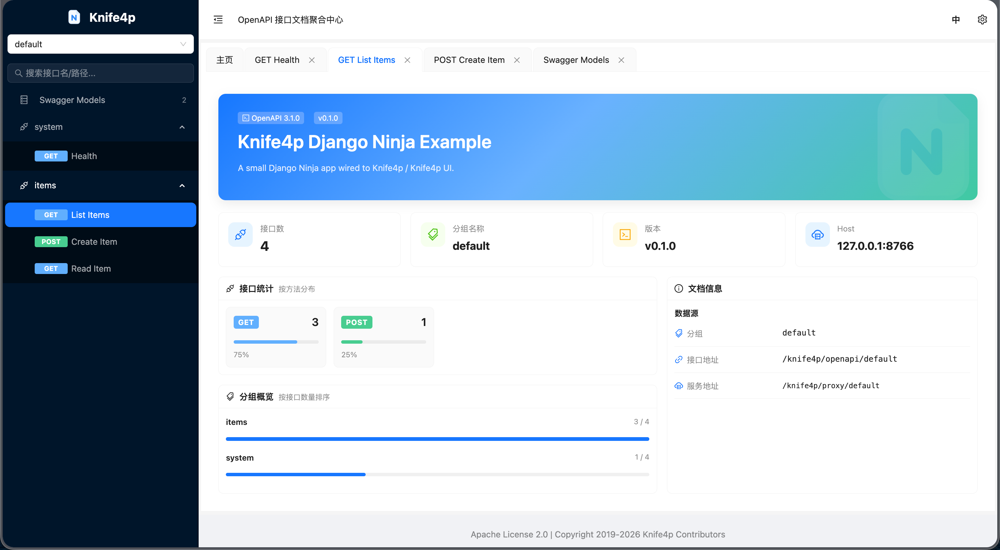
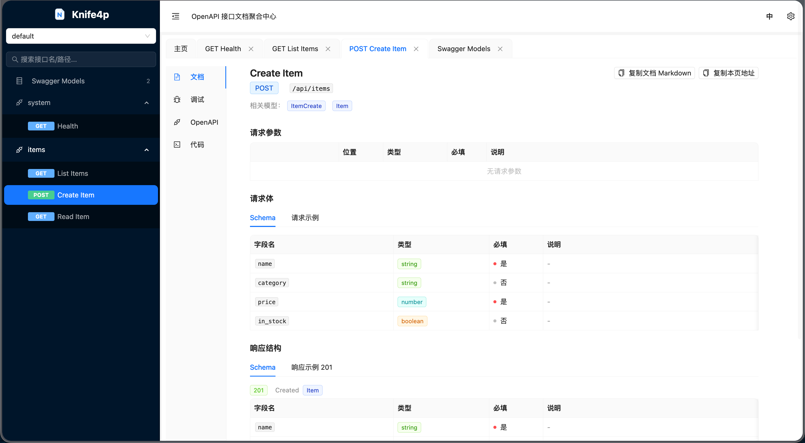

# Knife4p

Knife4p 是一个面向 Python Web 项目的 Knife4j / Knife4p OpenAPI UI 适配器。

它把 Knife4p OpenAPI3 前端静态资源打包进 Python 包中，并提供一组兼容 Springdoc / Springfox 风格的接口，让 FastAPI、Starlette、Django Ninja 等项目可以通过 `/doc.html` 使用 Knife4p 文档页面。

## 特性

- 内置 Knife4p OpenAPI3 UI 静态资源，无需单独部署前端。
- 支持 ASGI 项目，包含 FastAPI 和 Starlette。
- 支持 Django / Django Ninja，通过 `django_urls()` 接入。
- 支持多个 OpenAPI 分组。
- 支持把 UI 的 Try it out 请求代理回业务服务。
- 支持相对路径和绝对 URL 的 OpenAPI schema。
- 暴露 Springdoc / Springfox 常见兼容端点，方便 Knife4p UI 读取配置。

## 界面预览

### 文档首页



### 接口文档



## 环境要求

- Python 3.9+
- `httpx`
- `starlette`

FastAPI、Django 和 Django Ninja 不是核心依赖。只有在对应项目里使用时才需要安装。

## 安装

从源码开发时：

```bash
uv sync --extra test
```

在其他项目中使用时，可以按你的包管理方式安装：

```bash
pip install knife4p
```

如果暂时还没有发布到包仓库，也可以从本地构建产物或源码路径安装：

```bash
pip install dist/knife4p-0.1.0-py3-none-any.whl
# 或
pip install /path/to/knife4p
```

## 核心概念

Knife4p 的配置由两个对象组成：

```python
from knife4p import Knife4pConfig, OpenAPIGroup

config = Knife4pConfig(
    title="My API Docs",
    groups=[
        OpenAPIGroup(
            name="default",
            openapi_url="/openapi.json",
        )
    ],
)
```

### `Knife4pConfig`

| 参数 | 默认值 | 说明 |
| --- | --- | --- |
| `groups` | 无 | OpenAPI 分组列表，至少需要一个分组。 |
| `docs_path` | `/doc.html` | Knife4p UI 页面地址。 |
| `assets_path` | `/webjars` | 前端静态资源挂载路径。 |
| `api_prefix` | `/knife4p` | Knife4p 后端辅助接口前缀。 |
| `title` | `Knife4p` | 文档页面标题。 |

### `OpenAPIGroup`

| 参数 | 默认值 | 说明 |
| --- | --- | --- |
| `name` | 无 | 分组名称，会自动生成稳定 slug，例如 `Default API` 会变成 `default-api`。 |
| `openapi_url` | 无 | OpenAPI JSON 地址。可以是 `/openapi.json` 这类相对路径，也可以是完整 URL。 |
| `proxy_base_url` | `None` | Try it out 代理目标。为空时会使用 `openapi_url` 推断出的 origin。 |
| `headers` | `{}` | 拉取 OpenAPI JSON 时附加的请求头，例如鉴权头。 |
| `timeout` | `10.0` | 拉取 OpenAPI JSON 和代理请求的超时时间，单位为秒。 |
| `allow_try_it` | `True` | 是否允许 Try it out 代理请求。 |

## FastAPI 项目接入方法

### 1. 安装依赖

FastAPI 项目需要安装 FastAPI 和 ASGI 服务器：

```bash
pip install knife4p fastapi uvicorn
```

### 2. 在 FastAPI 应用中挂载 Knife4p

在你的 `main.py` 或应用入口文件中加入：

```python
from fastapi import FastAPI
from knife4p import Knife4pConfig, OpenAPIGroup, mount_fastapi

app = FastAPI(
    title="My FastAPI Service",
    version="1.0.0",
)


@app.get("/health", tags=["system"])
def health():
    return {"status": "ok"}


mount_fastapi(
    app,
    Knife4pConfig(
        title="My FastAPI Service",
        groups=[
            OpenAPIGroup(
                name="default",
                openapi_url="/openapi.json",
            )
        ],
    ),
)
```

启动服务：

```bash
uvicorn main:app --reload
```

访问：

```text
http://127.0.0.1:8000/doc.html
```

### 3. 开启 Try it out 代理

Knife4p 会把 OpenAPI schema 中的 `servers` 重写为 `/knife4p/proxy/{group}`，这样页面上的 Try it out 请求可以由 Knife4p 代理到业务服务。

如果业务服务和文档服务是同一个 FastAPI 应用，通常只需要：

```python
OpenAPIGroup(
    name="default",
    openapi_url="/openapi.json",
)
```

如果 OpenAPI JSON 或业务接口来自另一个服务，建议显式配置 `proxy_base_url`：

```python
OpenAPIGroup(
    name="remote",
    openapi_url="https://api.example.com/openapi.json",
    proxy_base_url="https://api.example.com",
)
```

如果只想展示文档，不允许在线调试：

```python
OpenAPIGroup(
    name="default",
    openapi_url="/openapi.json",
    allow_try_it=False,
)
```

### 4. 运行仓库内 FastAPI 示例

```bash
uv run --extra test uvicorn examples.fastapi_app:app --host 127.0.0.1 --port 8765 --reload
```

打开：

```text
http://127.0.0.1:8765/doc.html
```

## Django Ninja 项目接入方法

### 1. 安装依赖

Django Ninja 项目需要安装 Django 和 Django Ninja：

```bash
pip install knife4p django django-ninja
```

### 2. 在 `urls.py` 中加入 Ninja API 和 Knife4p 路由

典型的 Django Ninja `urls.py`：

```python
from django.urls import include, path
from ninja import NinjaAPI
from knife4p import Knife4pConfig, OpenAPIGroup, django_urls

api = NinjaAPI(
    title="My Django Ninja Service",
    version="1.0.0",
)


@api.get("/health", tags=["system"])
def health(request):
    return {"status": "ok"}


urlpatterns = [
    path("api/", api.urls),
    path(
        "",
        include(
            django_urls(
                Knife4pConfig(
                    title="My Django Ninja Service",
                    groups=[
                        OpenAPIGroup(
                            name="default",
                            openapi_url="/api/openapi.json",
                        )
                    ],
                )
            )
        ),
    ),
]
```

启动 Django：

```bash
python manage.py runserver 127.0.0.1:8000
```

访问：

```text
http://127.0.0.1:8000/doc.html
```

### 3. Django Ninja 的路径注意事项

如果你的 Ninja API 挂载在：

```python
path("api/", api.urls)
```

那么 Django Ninja 默认 OpenAPI JSON 地址通常是：

```text
/api/openapi.json
```

因此 `OpenAPIGroup.openapi_url` 应配置为：

```python
OpenAPIGroup(
    name="default",
    openapi_url="/api/openapi.json",
)
```

如果你的 API 挂载在其他路径，例如：

```python
path("internal/api/", api.urls)
```

则对应配置为：

```python
OpenAPIGroup(
    name="internal",
    openapi_url="/internal/api/openapi.json",
)
```

### 4. Django Ninja 的 Try it out 代理

同一个 Django 服务内使用时，通常只配置 `openapi_url` 即可：

```python
OpenAPIGroup(
    name="default",
    openapi_url="/api/openapi.json",
)
```

如果 Knife4p 文档页面和业务 API 不在同一个服务，需要指定代理目标：

```python
OpenAPIGroup(
    name="remote",
    openapi_url="https://api.example.com/openapi.json",
    proxy_base_url="https://api.example.com",
)
```

生产环境不希望开放在线调试时：

```python
OpenAPIGroup(
    name="default",
    openapi_url="/api/openapi.json",
    allow_try_it=False,
)
```

### 5. 运行仓库内 Django Ninja 示例

```bash
uv run --extra test python examples/django_ninja_app.py runserver 127.0.0.1:8766
```

打开：

```text
http://127.0.0.1:8766/doc.html
```

## Starlette 项目接入方法

Starlette 项目可以直接创建 Knife4p ASGI 应用，也可以把它挂载到现有应用中。

```python
from starlette.applications import Starlette
from knife4p import Knife4pConfig, OpenAPIGroup, mount_fastapi

app = Starlette()

mount_fastapi(
    app,
    Knife4pConfig(
        groups=[
            OpenAPIGroup(name="default", openapi_url="/openapi.json"),
        ],
    ),
)
```

也可以单独创建 Knife4p 应用：

```python
from knife4p import Knife4pConfig, OpenAPIGroup, create_app

app = create_app(
    Knife4pConfig(
        groups=[
            OpenAPIGroup(name="default", openapi_url="/openapi.json"),
        ],
    )
)
```

## 多分组配置

当一个文档页面需要展示多个服务或多个版本时，可以配置多个 `OpenAPIGroup`：

```python
Knife4pConfig(
    title="Platform API",
    groups=[
        OpenAPIGroup(
            name="User API",
            openapi_url="/user/openapi.json",
            proxy_base_url="/user",
        ),
        OpenAPIGroup(
            name="Billing API",
            openapi_url="https://billing.example.com/openapi.json",
            proxy_base_url="https://billing.example.com",
            headers={"Authorization": "Bearer token"},
        ),
    ],
)
```

分组名称会自动生成 URL slug：

| 分组名称 | slug | OpenAPI 代理地址 |
| --- | --- | --- |
| `User API` | `user-api` | `/knife4p/openapi/user-api` |
| `Billing API` | `billing-api` | `/knife4p/openapi/billing-api` |

分组名称大小写不敏感，不能重复。例如 `Default API` 和 `default api` 会被视为重复分组。

## 暴露的端点

默认配置下，Knife4p 会暴露以下端点：

| 路径 | 说明 |
| --- | --- |
| `/doc.html` | Knife4p UI 页面。 |
| `/docs` | 重定向到 `docs_path`，默认是 `/doc.html`。 |
| `/favicon.ico` | 文档页面图标。 |
| `/webjars/...` | Knife4p UI 静态资源。 |
| `/img/...` | Knife4p UI 图片资源。 |
| `/v3/api-docs/swagger-config` | Springdoc 风格 UI 配置。 |
| `/swagger-resources` | Springfox 风格资源列表。 |
| `/swagger-resources/configuration/ui` | Swagger UI 兼容配置。 |
| `/knife4p/openapi/{group}` | 按分组拉取并处理 OpenAPI JSON。 |
| `/knife4p/proxy/{group}/{path}` | Try it out 请求代理。 |

如果修改了 `Knife4pConfig.docs_path`、`assets_path` 或 `api_prefix`，对应端点也会随之变化。

## 代理行为说明

`/knife4p/proxy/{group}/{path}` 只会代理到当前分组对应的 `proxy_base_url`，或者从 `openapi_url` 推断出来的 origin。

例如：

```python
OpenAPIGroup(
    name="Remote",
    openapi_url="https://api.example.com/openapi.json",
)
```

没有显式配置 `proxy_base_url` 时，代理目标 origin 会推断为：

```text
https://api.example.com
```

如果配置：

```python
OpenAPIGroup(
    name="Remote",
    openapi_url="https://docs.example.com/openapi.json",
    proxy_base_url="https://api.example.com",
)
```

则 Try it out 请求会被转发到：

```text
https://api.example.com
```

代理会过滤 hop-by-hop 请求头，并只保留常见业务请求头、`x-*` 请求头，以及响应中的 `content-type`、`cache-control`。

## 常见问题

### 访问 `/doc.html` 能打开，但没有接口列表

先检查 `openapi_url` 是否能直接访问。

FastAPI 默认通常是：

```text
/openapi.json
```

Django Ninja 挂载在 `path("api/", api.urls)` 时通常是：

```text
/api/openapi.json
```

### Try it out 请求打到了错误地址

显式配置 `proxy_base_url`：

```python
OpenAPIGroup(
    name="default",
    openapi_url="/openapi.json",
    proxy_base_url="http://127.0.0.1:8000",
)
```

### 需要给 OpenAPI JSON 请求加鉴权头

使用 `headers`：

```python
OpenAPIGroup(
    name="private",
    openapi_url="https://api.example.com/openapi.json",
    headers={"Authorization": "Bearer your-token"},
)
```

### 生产环境想关闭 Try it out

使用 `allow_try_it=False`：

```python
OpenAPIGroup(
    name="default",
    openapi_url="/openapi.json",
    allow_try_it=False,
)
```

## 开发

安装开发依赖：

```bash
uv sync --extra test
```

运行测试：

```bash
uv run pytest
```

运行 FastAPI 示例：

```bash
uv run --extra test uvicorn examples.fastapi_app:app --host 127.0.0.1 --port 8765 --reload
```

运行 Django Ninja 示例：

```bash
uv run --extra test python examples/django_ninja_app.py runserver 127.0.0.1:8766
```

构建包：

```bash
uv build
```

## 项目结构

```text
knife4p/
├── src/knife4p/
│   ├── app.py          # ASGI 应用、静态资源、OpenAPI 拉取和代理逻辑
│   ├── config.py       # Knife4pConfig 和 OpenAPIGroup
│   ├── django.py       # Django URL 适配器
│   └── assets/         # Knife4p UI 静态资源
├── examples/
│   ├── fastapi_app.py
│   ├── django_ninja_app.py
│   └── django_ninja_urls.py
└── tests/
```

## 许可证和来源

Knife4p 使用 Apache License 2.0 发布。

本项目打包的 Knife4p OpenAPI3 UI 静态资源来自 `songxychn/knife4j-next`，对应 Maven 包为 `com.baizhukui:knife4j-openapi3-ui:5.0.13`。
